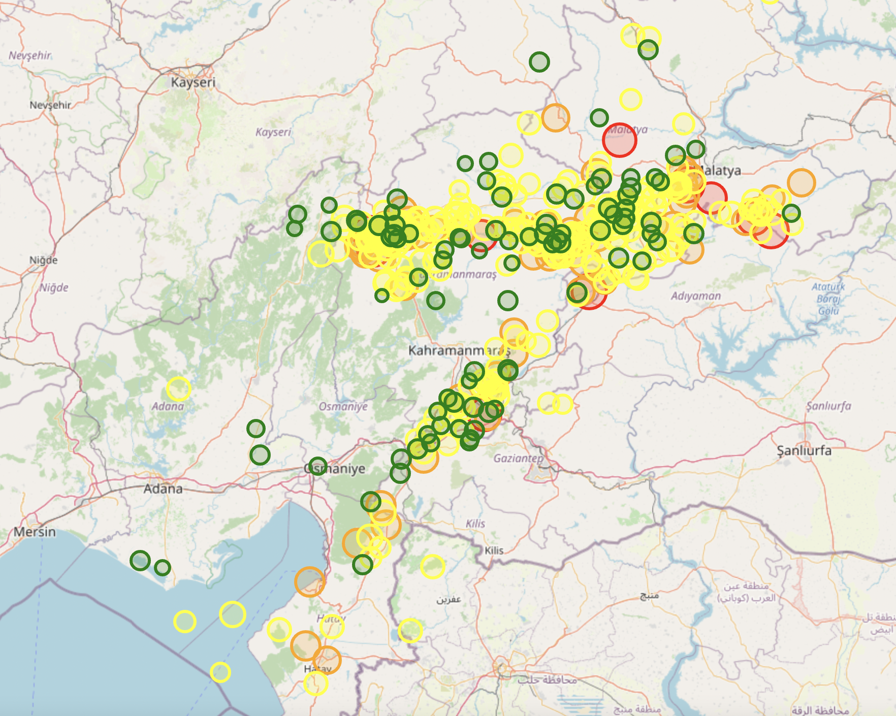

# Earthquake

A web-based application that visualizes earthquake locations in Turkey on a map.

## Demo

Check out the live demo at [earthquake.fly.dev](https://earthquake.fly.dev/).

## Technologies Used

- Python

## Features

- Visualization of earthquake locations on a map.
- Display of earthquake information such as magnitude, time, and location.

## Installation

1. Clone the repository: `git clone https://github.com/muhtalipdede/earthquake.git`
2. Install the dependencies: `pip install -r requirements.txt`
3. Run the development server: `python earthquake.py`
4. Visit [http://localhost:5000](http://localhost:5000) in your browser to view the app.

## Contributing

If you'd like to contribute to the project, please open a pull request with your changes.

## License

This project is licensed under the [MIT License](LICENSE).

## Screenshots

